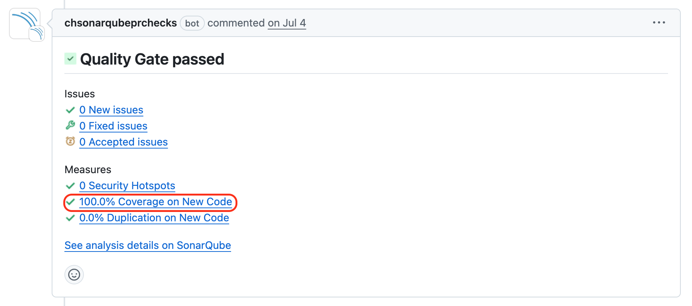

# Testing
psc-verification-web utilises unit tests and integration tests to ensure code quality and reliability. This document outlines our testing approach, tools, and best practices.

## Test directory structure
The `test/` directory is organised to reflect the structure of the application. See [Application Design](./application-design.md) for more information about the structure.

## Tools and frameworks
The following tools and frameworks are used for testing:

- [**Jest**](https://www.npmjs.com/package/jest): Main testing framework for unit and integration tests.
- [**Cheerio**](https://www.npmjs.com/package/cheerio): Used for parsing HTML in integration tests.
- [**Supertest**](https://www.npmjs.com/package/supertest): For HTTP assertions in our integration tests.

## Running tests

### Command line
To run tests with coverage:
```bash
make test
```

### Using VSCode
You can run tests directly from VSCode by using the built-in test runner or the Jest extension. Either open the test file and execute the desired test, or use the test runner sidebar to run all tests. Depending on your VSCode settings, tests may run every time you save a source file.

### Pre-commit
Each git commit will trigger a pre-commit hook that will block the commit unless all tests pass.

### SonarQube analysis
When a GitHub PR is pushed or updated, SonarQube will perform an analysis on the new code. New code must have test coverage of >80%. Clicking through to SonarQube's analysis report is useful for identifying exactly which lines or conditions are uncovered.


> Clicking this link will show you the full coverage report.

## Writing tests
As a rule of thumb, it's worth checking to see real examples of test suites for similar functionality within psc-verification-web. Otherwise, follow the guidance below:

### Unit tests
Unit tests should:
- Focus on a single function or component.
- Use mocks and stubs to simulate dependencies.
- Be located in the `test` directory with an `.unit.ts` suffix.

```typescript
describe('Example function', () => {
  it('should return the correct value', () => {
    const result = exampleFunction();
    expect(result).toBe('expectedValue');
  });
});
```

### Integration tests
Integration tests should:
- Test the interaction between multiple components.
- Be located in the `test` directory with an `.int.ts` suffix.

```typescript
describe('Service endpoint', () => {
  it('should return 200 status', async () => {
    const response = await request(app).get('/endpoint');
    expect(response.status).toBe(200);
  });
});
```

## Best practices
- Write tests for all new features and bug fixes.
- Use descriptive test names.
- Keep tests independent.
- Mock external dependencies to avoid fragility.
- Avoid depending on dynamic data such as the current date and time.
